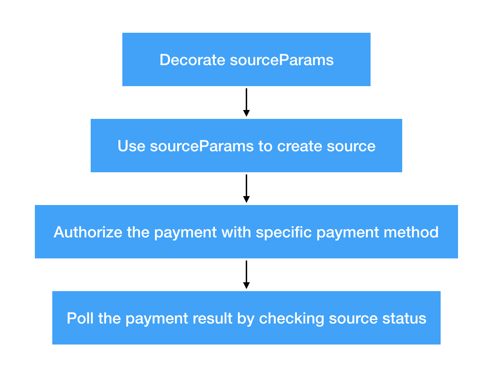

In this article, we will introduce how we implement the built-in user interface and discuss the details. Once you understand the implementation secret, you could make your own user interface for your requirement.

### Overview

TakeMe Pay SDK prepares extensible and flexible APIs for developers to create your own graphic user interface, even if you don't want to have any graphic user interface, you can also use TakeMe Pay SDK provided APIs to implement a component to make it happens.

TakeMe Pay SDK provides a built-in graphic user interface for payment checkout, it been treated as same as the component which you are going to create, so in this article, we will follow the steps to understand how to create a component and use it with TakeMe Pay SDK.

### Background Introduction

The only one required protocol if you want to implement a component named `TMPPaymentSourceParamsPreparer`, it conforms to `TMPPaymentDelegate` protocol. We can take a look at this protocol as follow:

```objc

#import <Foundation/Foundation.h>
#import "TMPPaymentDelegate.h"

@class TMPPayment, TMPPaymentMethod;

NS_ASSUME_NONNULL_BEGIN

@protocol TMPPaymentSourceParamsPreparer <NSObject, TMPPaymentDelegate>

@required
/**
 Parent TMPPayment instance, here use strong reference because we want to make a retain recycle, so that user can just create a TMPPayment instance and doesn't need to retain it.
 */
@property (nonatomic, strong) TMPPayment *payment;

/**
 The latest error the preparer received from TMPPayment by listening TMPPaymentDelegate methods
 */
@property (nonatomic, strong, nullable) NSError *latestError;

/**
 Abstract method, subclass should override it.
 
 Return the desired payment method you got from TMPSourceTypesContext previously, this method would be called after you call `completion` callback of TMPPaymentSourceParamsProcessable method, your `payment:processSourceParams:completion:` method could ignore processing payment method related logic, TMPPayment would handle with it.
 
 @return payment method instance
 */

- (TMPPaymentMethod *)paymentMethod;

/**
 Abstract method, subclass should override it.
 
 Decorate the source params, it should pass the final source params ( means it could be used to create source ) to the completion in any cases. This method may be a good place for you to do any UI actions, TMPPayment always waiting for your completion block invoking.
 IMPORTANT: Whether in the case of success or failure, you should and must always call completion, otherwise, the TMPPayment might be in memory leaked status.
 
 @param rawSourceParams Raw source params, may only contains very limit information provided by you in the init method of TMPPayment.
 @param sourceTypes All available source types of the merchant, you should always use source types with it.
 @param userInfo Reserved for future, not used now.
 @param decoratedSourceParamsBlock Pass in your decorated source params to this block
 @param completion You must call this completion callback in any cases, if the payment is no longer needed, pass nil ( e.g. you are going to dismiss the checkout counter view, the payment is no longer needed in this case, pass nil after dismiss the UI in preparer, if you pass non-nil value into completion block, it would rise a payment process up, no matter it's the first time or the second time be called ). The completion MAY be retained by the decorator, you should always assume it would be retained.
 */
- (void)prepareSourceParams:(TMPSourceParams *)rawSourceParams availableSourceTypes:(NSArray<TMPPaymentMethod *> *)sourceTypes userInfo:(nullable NSDictionary *)userInfo decoratedSourceParams:(void(^)(TMPSourceParams *decoratedSourceParams))decoratedSourceParamsBlock completion:(void(^)(TMPPaymentResultState currentState, NSError * _Nullable error))completion;

@end

NS_ASSUME_NONNULL_END

```

As you see, the protocol has only two required method which needs developer to implement.

Why we name the component as a `Source Params Preparer` is that the main task of the component is __prepare__ the source params indeed. If you follow our guides step by step, you might know the `Source Params` indicates a payment in TakeMe Pay SDK scope, it contains many very important details which related to the payment, such as `amount`, `currency`, `description`. But for making a payment happens, we also need to fulfil more critical properties to `Source Params` object, like `type`, `flow` or `metadata`, that's one task of `Source Params Preparer`.

> The `metadata` might be used to request some specific payment brand, which needs passing additional information to TakeMe Pay backend.

We give fully extensibility to the `Source Params Preparer`, you can prepare the source params with a graphic user interface, with your own business logic if you need, or if you don't want to have any graphic user interface, you could implement the business logic without it, just fulfil those required details, tell TakeMe Pay SDK which payment method you want to use, and last, return the decorated source params.

### How the Built-in Source Params Preparer been implemented

The built-in source params preparer named `TMPUIPaymentSourceParamsPreparer`, it provides the graphic user interface you have seen in previous tutorial [How to integrate TakeMePay in your app]().

#### Step 1

Override the initializer, create the root view controllers and related navigation controller, retain the navigation controller as strong reference.

#### Step 2

Implement `TMPPaymentSourceParamsPreparer` protocol, add `paymentMethod` and `prepareSourceParams:availableSourceTypes:userInfo:decoratedSourceParamsBlock:completion:` method.

The `paymentMethod` method should return the payment method you want to use in current payment. For example, if you want to make the current payment with `WeChat Pay`, you need to return the `TMPPaymentMethodWeChatPay` object inside the `paymentMethod`.

> Note: You should __never__ create the instance of subclass or `TMPPaymentMethod` itself directly, and always use the payment methods list which been passed into the `prepareSourceParams:availableSourceTypes:userInfo:decoratedSourceParams:completion:` as the second one of arguments.
> For historical reasons, the meaning of `payment method` equals to `source types`, but in different name.

In the `TMPUIPaymentSourceParamsPreparer`, we declare a property named `selectedPaymentMethod`, which the type is `TMPPaymentMethod`.

Inside the implementation of `prepareSourceParams:availableSourceTypes:userInfo:decoratedSourceParams:completion:` method, we copy the passed in `decoratedSourceParamsBlock`, `sourceParams` and `completion` first, and use `sourceTypes` (payment methods) and `rawSourceParams` (item description, item image, amount, currency...) to render the checkout view and the payment methods list view, then show the root view controller ( checkout view controller embedded in the navigation controller ).

Everytime user changes the payment method in payment methods list, we update the latest payment method as the `selectedPaymentMethod` in the built-in source params preparer.

Once user press the `PAY` button, we would invoke the `decoratedSourceParamsBlock` block which we retained previously, pass the decorated source params into it, the demonstrate purpose code snippet like follows:

```objc

- (TMPPaymentMethod *)paymentMethod {
    return self.selectedPaymentMethod;
}

- (void)checkoutCounter:(UIViewController<TMPPaymentUICheckoutCounterRenderer> *)checkoutCounter payPressed:(NSDictionary *)userInfo {
    // re-assign latest error as nil, it means the preparer starts a new payment
    self.latestError = nil;
    
    checkoutCounter.paymentStatus = TMPPaymentResultStateInProgress;

    if (self.decoratedSourceParamsBlock) {
        self.decoratedSourceParamsBlock(self.sourceParams);
    }
}

```

Once you invoke the `decoratedSourceParams()` with correct and well prepared source params, the payment flow will be continued, driven by the `TMPPayment`.

But we still need one step to make the payment flow completed in the `Source Params Preparer`.

#### Step 3

To introduce step 3, we think we should introduce some important phrase in the payment flow first:



As above, once you invoke the `decoratedSourceParams()` with decorated source params, the `TMPPayment` will use it to create the `source`, an instance of `source` indicates a payment. Then the `TMPPayment` will use the source which returned from TakeMe Pay backend to request the authorization with specific payment method. Once user verifies the payment with payment service ( for example, if you use wechat pay as the payment method, the authorization will guide you to `WeChat` app to input your password of `WeChat Pay`. ), the `TMPPayment` will polls the payment result from TakeMe Pay backend and check if the status has been changed to `consume` ( make the status of source as `consume` needs your backend involved, by listening to the webhooks you register to TakeMe Pay system ).

Every phrase behind the invoking of `decoratedSourceParams()` might raise errors, so your `Source Params Preparer` need to listen to those delegate methods, to well respond the errors. As for our built-in source params preparer, we implement them as below:

```objc

- (void)showFailureAndRestoreStateToIdle {
    // show the error icon first
    // then restore from the error state to idle state, to remind user to retry the payment
}

- (void)payment:(TMPPayment *)payment didCreateSource:(TMPSource *)source error:(NSError *)error userInfo:(NSDictionary *)userInfo {
    if (error) {
        self.latestError = error;
        
        [self showFailureAndRestoreStateToIdle];
    }
}

- (void)payment:(TMPPayment *)payment didFinishAuthorization:(TMPPaymentAuthorizationState)state error:(NSError *)error userInfo:(NSDictionary *)userInfo {
    if (error) {
        self.latestError = error;
        
        [self showFailureAndRestoreStateToIdle];
    }
}

- (void)payment:(TMPPayment *)payment didPolledSource:(TMPSource *)source state:(TMPPaymentPollingResultState)state error:(NSError *)error userInfo:(NSDictionary *)userInfo {
    if (error) {
        self.latestError = error;
        
        if (state == TMPPaymentPollingResultStateTimeout) {           
            // ...
            // UI should respond to the state
            // error occurred in polling phrase, we assume that user has paid successfully ( because only if the user authorize their payment successfully, the payment flow will get to here ), but the SDK can't get the result from TakeMePay backend now ( might be network issues ), so we can't ask user to pay the payment again, so here we check the state if it is TMPPaymentPollingResultStateTimeout.
                        
            [self.vcPresenter payment:payment dismissPaymentViewController:self.checkoutCounterRenderer completion:^{
                if (self.completion) {
                    self.completion(TMPPaymentResultStatePossibleSuccess, nil);
                }
            }];            
        } else {
            [self showFailureAndRestoreStateToIdle];
        }
    } else {
        if (state == TMPPaymentPollingResultStateSuccess) {
            // ...
            // UI should respond to the state                        
                        
            [self.vcPresenter payment:payment dismissPaymentViewController:self.checkoutCounterRenderer completion:^{
                if (self.completion) {
                    self.completion(TMPPaymentResultStateSuccess, nil);
                }
            }];                                          
        }       
    }
}

```

You may have noticed that we record the latest error if it exists, for simplifying the `TMPPayment` flow, we don't retain the latest error for developers, you should save it by yourself, and pass it into the `completion` block in your `Source Params Preparer` when you invoke it, so that `TMPPayment` and the developers who use your custom `Source Params Preparer` can get more useful information to find the reason of error if any error occurs.

You should always call the `completion` block when you are sure the current payment flow has been done, with correct `TMPPaymentResultState` and `error`.

### Questions?

We're more than happy to help with any questions you have! Feel free to talk to our team.

� Japan Foodie 2019