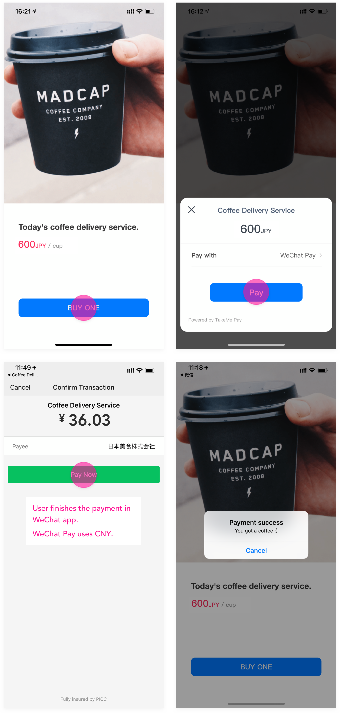

TakeMe Pay is a payment aggregator that gives you access to dozens of payment brands via an unified API. This article explains how to integrate TakeMe Pay SDK into your iOS apps.

### Overview

Integrating with TakeMe Pay SDK takes the following steps:

1. Get API keys.
2. Install TakeMe Pay SDK into your app via CocoaPods or manually.
3. Use TakeMe Pay SDK in your app to make payments.
4. Prepare your server-side API to receive notifications and send acknowledgements from/to our server.

We'll walk you through the integration process using a demo iOS app called Coffee Delivery. The app allows you to order a cup of coffee and pay for it, as shown in the picture below:



### Getting Started

Please make sure that you have access to a mainland Chinese user account. As of now, the WeChat platform may not allow non-Chinese citizens to use WeChat abroad. If you encounter errors, please check to make sure that you are using a mainland Chinese user account first.

To make it easier for you, we have provided our tutorial project in both [Objective-C](https://github.com/takeme-pay/CoffeeDelivery/tree/raw) and [Swift](https://github.com/takeme-pay/CoffeeDelivery/tree/Swift_Tutorial) with the core features of Coffee Delivery, but without the integration of the SDK. 
Go ahead and download the project, then open it in Xcode.

If you want to see the finalized Xcode project, it's also [available](https://github.com/takeme-pay/CoffeeDelivery/tree/master).

REMINDER: Remember to add "AppTransportSecurity" if you have not already. You can find more information about that [here](https://stackoverflow.com/questions/31216758/how-can-i-add-nsapptransportsecurity-to-my-info-plist-file/)

# NOTE:
If you are using SWIFT, then you need to have a bridging header if you do not already have one. You can find more information on bridging headers [here](https://www.hackingwithswift.com/example-code/language/how-to-create-an-objective-c-bridging-header-to-use-code-in-swift)

Then add the following to your bridging header file:

```
#import <TakeMePaySDK/TakeMePaySDK.h>
```

### Get API Keys

You'll need `public key` and `secret key` for SDK and server-side integrations, respectively. If you don't have them already, please contact our sales team.

You'll also need `WeChat Pay App ID` if you want WeChat Pay. To obtain this app id, you can either become a WeChat developer on the WeChat Open Platform and get the app id from them, or ask us to issue a app id on behalf of you.

### Install TakeMe Pay SDK into Your App

Installation is quite simple using [CocoaPods](https://cocoapods.org/):

1. Add these to your `Podfile`:

    ```
    pod 'TakeMePaySDK'
    ```
    
    
    ```
    pod 'TakeMePaySDK-WeChatPaySupport'
    ```
    
2. Navigate to the project's directory in Terminal.
3. Run `pod install`.

Depending on your CocoaPods configuration and version, you may need to change its `platform` to `10.0` in your `Podfile`, e.g. `platform :ios, '10.0'`.

You can, also, choose to install the SDK the manual way. Just download [TakeMePaySDK](https://github.com/takeme-pay/TakeMePaySDK-iOS-Core) and [TakeMePaySDK-iOS-WeChatPaySupport](https://github.com/takeme-pay/TakeMePaySDK-iOS-WeChatPaySupport) frameworks and manually put them into your Xcode project folder.

### Use TakeMe Pay SDK in your app

First of all, we strongly recommend you add environment variable `TMP_PRINT_CONSOLE_LOG` to your Xcode scheme so that you can see logs output by the SDK, directly in Xcode. To do this, open the `Coffee Delivery` project in Xcode, edit the target scheme, click `Arguments` section, click `+` button to add a new environment variable, use `TMP_PRINT_CONSOLE_LOG` as the key and `1` as the value.

Now, let's update a few files to actually add the SDK.

## Step 1

We need to add the API keys.

OBJECTIVE-C

Open `AppDelegate.m`, find `application:didFinishLaunchingWithOptions:launchOptions:` (should be the first method), and add the following lines:

```objc
TakeMePay.publicKey = @"your public key"; // public key got from TakeMePay's platform previously and will be used to authenticate all network requests with TakeMe Pay server

TakeMePay.wechatPayAppId = @"your WeChat Pay App ID"; // fill the WeChat Pay app id which you got from WeChat Open Platform
```

SWIFT

Open `AppDelegate.swift`, find `application(didFinishLaunchingWithOptions:)` (should be the first method), and add the following lines:
```swift
TakeMePay.publicKey = "pk_test_sDkS-Zn8sf8iv0HgW7S9HBLd1LRwk7aAQ9yWVghD"

TakeMePay.wechatPayAppId = "wxf2ac9aae739daee5"
```

## Step 2

We should edit the URL Type by navigating to the project Target "Coffee Delivery"
Go to Info, then click the  '+' button to add a URL Type.
Under the 'URL Schemes', you need to put your Wechat Pay scheme (same as your TakeMePay.wechatPayAppID) as the "Editor" Role.

Also, because the payment needs to jump to Wechat app, we need to add the scheme of Wechat (`wechat` and `weixin`) in the Info.plist, under the LSApplicationQueriesSchemes key, to support the redirection. For more information, you could check the reference [here](https://developer.apple.com/documentation/uikit/uiapplication/1622952-canopenurl)

## Step 3

We need to handle the url jumping back request, add `application:openURL:options:`:

OBJECTIVE-C

```objc
- (BOOL)application:(UIApplication *)app openURL:(NSURL *)url options:(NSDictionary<UIApplicationOpenURLOptionsKey,id> *)options {
    return [TakeMePay shouldHandleUrl:url];
}
```

SWIFT

```swift
func application(_ app: UIApplication, open url: URL, options: [UIApplication.OpenURLOptionsKey : Any] = [:]) -> Bool {
    return TakeMePay.shouldHandle(with: url)
}
```

This method handles all url opening requests, so if you need to handle more than just our url, you should handle others by yourself, continue passing the current `url` to other logic after `[TakeMePay shouldHandleUrl:url]` returns `NO`, which means the url is not the responsibility of `TakeMePay SDK`.

## Step 4
We need to show the checkout UI and accept the payment. 

OBJECTIVE-C

Open `TMPCoffeeBuyingViewController.m` and add these code to the `pay:` method:

```objc

// 1. According to your needs, you could use this convenience initializer to generate a TMPSourceParams object
TMPSourceParams *params = [[TMPSourceParams alloc] initWithDescription:@"Coffee Delivery Service" amount:10 currency:@"JPY"];

// 2. Generates a TMPPayment object, which is the core part of once payment progress

// If you don't have requirement to implement your own SourceParamsPreparer, you can just use our built-in SourceParamsPreparer for convenience, the delegate is the recipient of payment message callbacks
TMPPayment *payment = [[TMPPayment alloc] initWithSourceParams:params delegate:self];

// sourceParamsPreparer is responsible for "modifying and decorate" the primitive params (such as selecting a specific payment channel through the UI, or filling in some other necessary information, and finally returning the params to the payment object that meets the required requirements, in this case, we use the SDK build-in preparer to enable the default UI. Of course, developer can fully customize a preparer, even create a payment without any UI intervention, depending on the developer's needs

// TMPPayment *payment = [[TMPPayment alloc] initWithSourceParams:params sourceParamsPreparer:[[YourCustomSourceParamsPreparer alloc] init] delegate:self];

// 4. start the payment process
[payment startPaymentAction];

// Or, we provide another `startPaymentAction:` method to take a dictionary for extra information, if you use our built-in SourceParamsPreparer, and the device supports Apple's Tapic Engine technology, you can pass an extra information dictionary like:
// [payment startPaymentAction:@{@"useTapicEngine" : @(YES)}];

```

SWIFT

Open `ViewController.swift` and add the following code to the `payButtonAction:` method:

```swift
        // 1. init a source params with necessary information.
        // 2. create TMPPayment from sourceParams, ephemerKeyProvider and delegate.
        guard !isInProgress,
            let params = TMPSourceParams(description: "Coffee Delivery Service", amount: 10, currency: "JPY"),
            let payment = TMPPayment(sourceParams: params, delegate: self) else {
            return
        }
        
        self.isInProgress = true
        
        // 3. start payment action. ( with optional tapic engine impact )
        payment.startAction(["useTapticEngine": true])
```

For receiving payment result, you could implement `payment(didFinishWithState:)` method to get the result of the payment, In this demo, we are going to pop up an alert view with specific payment result state.

You can compare your code against [the full source code](https://github.com/takeme-pay/CoffeeDelivery/tree/master) for your reference.

If you run the project now, you should be able to see the checkout UI.

But hold on! You are one step away from making a payment successfully.

### Prepare your server-side API

To make a payment in Coffee Delivery, you'll need some server-side API to talk to the TakeMe Pay server. This is because when you try to make a payment in the iOS app, TakeMe Pay server will talk to your server to confirm the payment result via HTTPS requests. While the two sides are negotiating, TakeMe Pay SDK will wait, until the server-to-server conversation is over (or after certain amount of time, a.k.a timeout), and update its checkout UI to reflect the result.

The full technical details, as well as how you should implement your server API, is covered [here](https://bitbucket.org/r_developer/demo-go/src/master/README.adoc). 
At this time, you can simply download [our demo server implementation](https://bitbucket.org/r_developer/demo-go) and run it on your own server, so you don't have to roll out your own one. 

The demo server implementation is a single executable file, written in Go-lang, and can be run almost everywhere.

### Test

Once you have the demo server implementation up and running, finally it's time to run Coffee Delivery in Xcode on your iOS device.

### Questions?

We're more than happy to help with any questions you have! Feel free to talk to our sales team.

� Japan Foodie 2019